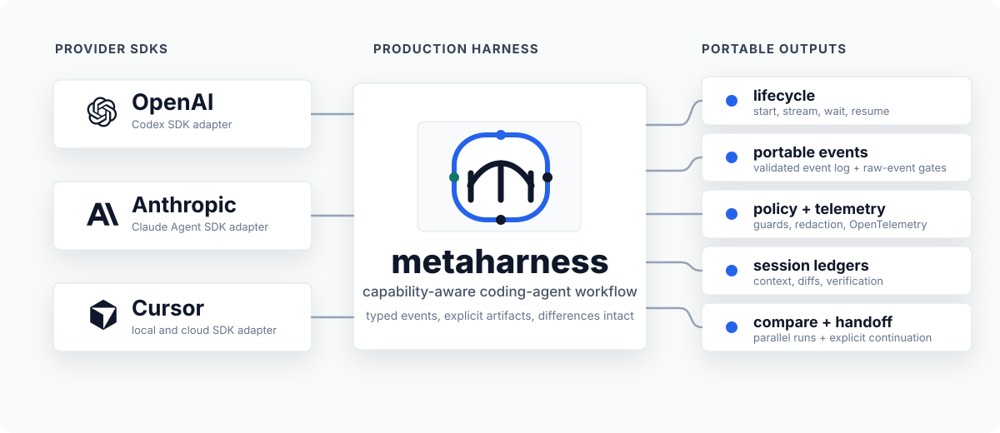

# metaharness

metaharness is a TypeScript-first SDK and CLI for running Claude, Cursor, Codex,
and deterministic mock coding agents through one production harness.

It gives application and platform teams one stable surface for lifecycle,
streaming, wait, cancel, resume, policy, telemetry, diffs, session ledgers,
compare, and handoff while keeping provider-specific behavior visible through
`ProviderCapabilities`.



## Skill for Coding Agents

If you use coding agents such as Claude Code, Codex, or Cursor, we highly
recommend adding the metaharness skill to your repository:

```bash
npx skills add faizancodes/meta-harness
```

## Use Cases

metaharness is useful when coding-agent work needs to be repeatable, observable,
and easy to hand off instead of living inside one chat window.

- **Run agents from product code** with one SDK surface for Claude, Cursor, and
  Codex.
- **Stream agent progress into a UI or worker** without coupling the app to one
  provider's event format.
- **Verify changes before accepting them** by attaching test, lint, build, or
  custom review commands to each run.
- **Compare providers on the same task** while keeping capability differences
  visible.
- **Handoff unfinished work** with an explicit ledger, patch, handoff prompt, and
  verification log.
- **Keep audit artifacts** for CI, platform teams, customer support, and
  post-run debugging.

Run a real provider and keep the useful artifacts:

```ts
const result = await harness.run({
  provider: "codex",
  task: "Find the smallest safe fix for the failing tests.",
  verification: ["pnpm test"]
});

console.log(result.runId);
console.log(result.ledgerPath);
console.log(result.patchPath);
console.log(result.verificationLogPath);
```

Stream progress into a terminal, dashboard, or queue worker:

```ts
const active = await harness.startRun({
  provider: selectedProvider,
  task: "Review this package and propose the next maintenance step."
});

for await (const event of active.events()) {
  if (event.type === "assistant.message.delta") {
    process.stdout.write(event.text);
  }
}

const result = await active.wait();
console.log(result.status);
```

Show provider-specific controls only when the selected agent supports them:

```ts
const caps = await harness.agent(selectedProvider).capabilities();

const controls = {
  canStream: caps.lifecycle.stream.supported,
  canCancel: caps.lifecycle.cancel.supported,
  canResume: caps.lifecycle.resume.supported,
  canOpenPullRequest: caps.workspace.openPullRequest.supported,
  canUseMcp: caps.tools.mcp.supported
};

console.log(controls);
```

Use the CLI for local automation, CI, compare, and handoff workflows:

```bash
pnpm hk run \
  --provider codex \
  --task "Summarize risky files before release" \
  --verify "pnpm test" \
  --stream

pnpm hk compare \
  --providers claude,cursor,codex \
  --task "Try the safest small refactor" \
  --verify "pnpm test"

pnpm hk ledger handoff latest
```

## Repository Status

The repo currently includes these workspace packages:

| Package                      | Purpose                                                                          |
| ---------------------------- | -------------------------------------------------------------------------------- |
| `@metaharness/core`          | Harness API, portable events, run storage, ledgers, handoff, compare, and doctor |
| `@metaharness/policy`        | Policy parsing, validation, provider hints, and command checks                   |
| `@metaharness/telemetry`     | Optional OpenTelemetry setup around harness spans                                |
| `@metaharness/adapter-mock`  | Deterministic in-process adapter for tests, examples, docs, and CI               |
| `@metaharness/claude`        | Claude Agent SDK adapter                                                         |
| `@metaharness/cursor`        | Cursor SDK adapter                                                               |
| `@metaharness/codex`         | Codex SDK adapter plus app-server mode                                           |
| `@metaharness/cli`           | `hk` command-line interface                                                      |
| `@metaharness/github-action` | GitHub Action wrapper around the harness API                                     |

The repo also includes docs, examples, JSON schemas, CI, and provider-gated
conformance tests.

Mock conformance runs in normal tests. Real provider conformance is opt-in with
provider SDKs, API keys, and gate environment variables.

## Quickstart

Start with a real provider. This example uses Codex; use `claude` or `cursor`
when that is the provider you configured.

```bash
corepack enable
pnpm install
pnpm setup:doctor
pnpm hk doctor --provider codex
pnpm hk run \
  --provider codex \
  --task "Summarize this repository" \
  --stream
```

`pnpm setup:doctor` verifies repository setup, editor defaults, agent guidance,
and ignore files, then builds the packages. `pnpm hk doctor --provider codex`
checks the live provider setup before the run.

Inspect the generated artifacts:

```bash
pnpm hk runs
pnpm hk stream latest
pnpm hk ledger show latest
pnpm hk ledger handoff latest
```

The final `run <run-id> success` line prints the explicit run id. Use that id
when inspecting an older run; use `pnpm hk runs` to list recent run ids, or use
`latest` for the most recent run under the active workspace and `storage.rootDir`.

`hk ledger show` prints a concise run summary with the event log, result,
ledger, handoff prompt, patch, verification log, raw-event status, changed files,
and verification outcomes. Use `pnpm --silent hk ledger show latest --json`
when automation needs the full `SessionLedger`.

Runs write to `.harness/runs/<run-id>/`:

```text
events.ndjson
result.json
ledger.json
handoff.md
diff.patch
verification.log
provider/raw-events.ndjson
```

Raw provider events are disabled by default and only written when raw capture is
explicitly enabled.

## Fresh Workspace Init

Use `hk init` when you want to create metaharness config files in a separate
workspace:

```bash
WORKDIR="$(mktemp -d)"
pnpm hk --cwd "$WORKDIR" init --providers codex,cursor,claude
pnpm hk --cwd "$WORKDIR" doctor --provider codex
pnpm hk --cwd "$WORKDIR" run --provider codex --task "Summarize this workspace"
pnpm hk --cwd "$WORKDIR" ledger show latest
```

`hk init` refuses to overwrite existing generated files. Use
`pnpm hk --cwd "$WORKDIR" init --force` only when you intentionally want to
regenerate `metaharness.config.ts`, `metaharness.policy.yaml`, and
`.harness/.gitignore`.

Keep the same `--cwd "$WORKDIR"` on follow-up commands so config, policy, and
`latest` resolve inside that workspace. In an installed consumer workspace, use
`pnpm exec hk`; inside this repository after `pnpm build`, `pnpm hk` runs the
built CLI.

## SDK Quickstart

```ts
import { createHarness, defineConfig } from "@metaharness/core";
import { ClaudeAdapter } from "@metaharness/claude";
import { CodexAdapter } from "@metaharness/codex";
import { CursorAdapter } from "@metaharness/cursor";

const selectedProvider = "codex" as const;

const config = defineConfig({
  workspace: { cwd: process.cwd() },
  defaultProvider: selectedProvider,
  providers: {
    claude: {
      provider: "claude",
      apiKeyEnv: "ANTHROPIC_API_KEY",
      runtime: "local"
    },
    cursor: {
      provider: "cursor",
      apiKeyEnv: "CURSOR_API_KEY",
      runtime: "local"
    },
    codex: {
      provider: "codex",
      apiKeyEnv: "OPENAI_API_KEY",
      runtime: "local"
    }
  },
  storage: {
    rootDir: ".harness",
    redactSecrets: true
  },
  rawEvents: false
});

const harness = createHarness(config, [
  new ClaudeAdapter(),
  new CursorAdapter(),
  new CodexAdapter()
]);

try {
  const doctor = await harness.doctor({ provider: selectedProvider });
  for (const check of doctor.checks) {
    if (check.status === "fail") {
      throw new Error(`${check.category}: ${check.name} failed`);
    }
  }

  const agent = harness.agent(selectedProvider);
  const caps = await agent.capabilities();

  if (caps.lifecycle.stream.supported) {
    const active = await agent.startRun({
      task: "Inspect the repo and produce a short summary."
    });

    for await (const event of active.events()) {
      if (event.type === "assistant.message.delta") {
        process.stdout.write(event.text);
      }
    }

    console.log(await active.wait());
  }
} finally {
  await harness.dispose();
}
```

Run `harness.doctor()` before live work and dispose the harness when a script or
service shuts down so adapters can release provider-native resources.

For product code, branch on capability flags instead of provider strings:

```ts
const caps = await harness.agent(selectedProvider).capabilities();

if (caps.workspace.openPullRequest.supported) {
  // Show PR controls.
}

if (!caps.lifecycle.cancel.supported) {
  // Hide or disable cancellation for this runtime.
}
```

## Provider Setup

Provider SDK packages are optional peer dependencies. For SDK usage, install
`@metaharness/core`, the adapter packages you use, and only the SDK peers for
real providers you run. For example, Codex:

```bash
pnpm add @metaharness/core @metaharness/codex
pnpm add -D @openai/codex-sdk
```

CLI-only and generated GitHub workflow usage does not require separate adapter
package installs because `@metaharness/cli` includes the metaharness adapters.
Install the CLI package plus only the real-provider SDK peers you plan to run:

```bash
pnpm add -D @metaharness/cli @openai/codex-sdk
```

For mock-only CLI usage, omit provider SDKs.

Use provider-supported API key environment variables:

| Provider | Adapter package       | SDK package                      | API key env         |
| -------- | --------------------- | -------------------------------- | ------------------- |
| Claude   | `@metaharness/claude` | `@anthropic-ai/claude-agent-sdk` | `ANTHROPIC_API_KEY` |
| Cursor   | `@metaharness/cursor` | `@cursor/sdk`                    | `CURSOR_API_KEY`    |
| Codex    | `@metaharness/codex`  | `@openai/codex-sdk`              | `OPENAI_API_KEY`    |

Use [.env.example](.env.example) as the placeholder-only live-provider
environment checklist. The repo does not auto-load it; copy values into your
shell, secret manager, or a local ignored `.env` file before running live
providers. Its API-key and live-gate values are blank by default so copying it
does not enable live provider tests.

Use `hk doctor` before live runs. Check the provider you are about to run:

```bash
pnpm hk doctor --provider codex
```

Without `--provider`, `hk run` and `hk doctor` use `defaultProvider` from the
active config, or `mock` when no config default is set.

Use `pnpm hk doctor --all` only when you intentionally configured every provider;
otherwise missing API keys for unused providers are reported as failures with
next-step guidance.

When setup, provider auth, JSON output, generated artifacts, or CI workflow
behavior is unclear, use the [Troubleshooting](docs/troubleshooting.md) guide.
If you already have a typed code from stderr, JSON, a thrown SDK error, or a
GitHub Action failure, start with the [Error codes](docs/error-codes.md)
reference.

## Common Commands

Start with the smallest command that matches the change, then run the broader
gate before a pull request, release change, or handoff:

| Need                                               | Start with                                                        |
| -------------------------------------------------- | ----------------------------------------------------------------- |
| Find repo commands                                 | `pnpm commands`                                                   |
| First local setup, editor, agent, and ignore check | `pnpm setup:check`                                                |
| Fresh clone CLI doctor                             | `pnpm setup:doctor`                                               |
| Normal local validation                            | `pnpm check`                                                      |
| PR, release, or handoff validation                 | `pnpm ci:check`                                                   |
| Targeted tests                                     | `pnpm test:project -- cli`, `pnpm --filter @metaharness/cli test` |
| SDK quickstart or examples                         | `pnpm example:sdk`, `pnpm examples:smoke`                         |
| CLI changes                                        | `pnpm cli:help:check`, `pnpm docs:cli:check`                      |
| Docs and examples                                  | `pnpm docs:check`                                                 |
| Generated artifacts                                | `pnpm generated:write`, then `pnpm generated:check`               |
| Local run artifacts                                | `pnpm artifacts:clean -- --dry-run`                               |
| All ignored local outputs                          | `pnpm clean -- --dry-run`                                         |
| Package or release changes                         | `pnpm package:check`, `pnpm consumer:smoke`, `pnpm release:check` |

The full root command inventory is:

```bash
pnpm artifacts:clean -- --dry-run
pnpm check
pnpm ci:check
pnpm clean -- --dry-run
pnpm commands
pnpm setup:check
pnpm setup:doctor
pnpm lint
pnpm typecheck
pnpm test
pnpm test:project -- cli
pnpm cli:help:check
pnpm docs:check
pnpm docs:cli:check
pnpm docs:validation:check
pnpm docs:links:check
pnpm docs:sources:check
pnpm docs:error-codes:check
pnpm docs:policy:check
pnpm docs:snippets:check
pnpm examples:docs:check
pnpm generated:check
pnpm generated:write
pnpm typecheck:examples
pnpm test:integration
pnpm test:live
pnpm build
pnpm package:check
pnpm example:sdk
pnpm examples:smoke
pnpm consumer:smoke
pnpm format
pnpm format:write
pnpm docs:capabilities
pnpm schemas:generate
pnpm changeset
pnpm version:packages
pnpm release:check
pnpm release:publish
pnpm hk --help
pnpm hk doctor --provider codex
pnpm hk docs capabilities
```

Use `pnpm ci:check` before a pull request, release change, or broad handoff. It
mirrors the credential-free CI gate by running `pnpm check`, generated artifact
checks, example smoke tests, and the downstream consumer install smoke.

Use `pnpm commands` when you want a terminal-first guide to the shortest setup,
mock smoke run, artifact inspection, validation, iteration, examples,
packaging, formatting, release-intent, live-provider, and support commands.
Use `pnpm --silent commands -- --json` when automation or an agent needs the
same curated command map plus example and support references as parseable JSON.

`pnpm test` builds packages before running Vitest so package entrypoint checks use
fresh `dist/` output. Use `pnpm test:project -- cli` for a fast source-only
Vitest project loop, or `pnpm test:integration` when you only need the
integration conformance project. `pnpm test:live` fails fast when no live
provider gate is set so a mock-only run cannot be mistaken for live coverage.
Live provider gates must be set to exactly `1`; values like `true` are ignored
and reported before Vitest starts. Run `pnpm test:live -- --help` to print the
provider gate/API-key matrix without starting Vitest.

`pnpm setup:check` verifies the active Node and pnpm versions, toolchain pins,
editor defaults, the env template, agent guidance, workspace settings, CI setup,
and ignore hygiene so build output, local `.harness` artifacts, `.env` secret
files, and generated TypeScript build info stay out of normal repo workflows.

Use `pnpm generated:write` to refresh all committed generated artifacts,
including provider capabilities and JSON Schemas, then confirm with
`pnpm generated:check`.

`pnpm format` and `pnpm format:write` default to the full repo. Append paths,
such as `pnpm format:write docs/sdk.md`, when you want a scoped Prettier pass.

Use `pnpm artifacts:clean -- --dry-run` to inspect ignored local `.harness`
artifacts, then `pnpm artifacts:clean -- --yes` when you intentionally want to
delete local run, compare, and worktree artifacts.

Use `pnpm clean -- --dry-run` to inspect every ignored local output target,
including package `dist/`, coverage, `.tsbuildinfo`, and `.harness` artifacts.
Deletion still requires `pnpm clean -- --yes`.

Use `pnpm --silent hk ... --json` when piping JSON output through pnpm scripts.
Without `--silent`, pnpm prints its script banner before the CLI output.
Do not combine `--json` with `--stream`; streaming output is human-readable
event text.

Live provider conformance is intentionally gated:

```bash
ANTHROPIC_API_KEY=... \
CURSOR_API_KEY=... \
OPENAI_API_KEY=... \
metaharness_TEST_CLAUDE=1 \
metaharness_TEST_CURSOR=1 \
metaharness_TEST_CODEX=1 \
metaharness_TEST_CODEX_APPSERVER=1 \
pnpm test:live
```

Use environment references or secret injection instead of literal key values
when running that command. [.env.example](.env.example) lists the same gates and
API-key names with empty placeholders, and is placeholder-only. Its gate values
stay blank until you intentionally set them to `1`. Use
`pnpm test:integration` instead when you want mock-only integration conformance.

## Documentation

- [Docs index](docs/README.md)
- [Glossary](docs/glossary.md)
- [SDK usage](docs/sdk.md)
- [CLI reference](docs/cli.md)
- [Configuration](docs/configuration.md)
- [Troubleshooting](docs/troubleshooting.md)
- [Error codes](docs/error-codes.md)
- [Development guide](docs/development.md)
- [Architecture](docs/architecture.md)
- [Adapters](docs/adapters.md)
- [Provider capabilities](docs/provider-capabilities.md)
- [Event model](docs/event-model.md)
- [Session ledger](docs/ledger.md)
- [Handoff](docs/handoff.md)
- [Policy](docs/policy.md)
- [Security](docs/security.md)
- [Security policy](SECURITY.md)
- [Conformance](docs/conformance.md)
- [GitHub Action](docs/github-action.md)
- [Verified sources](docs/verified-sources.md)
- [Examples](examples/README.md)
- [Contributing](CONTRIBUTING.md)
- [Support](SUPPORT.md)
- [Agent instructions](AGENTS.md)
